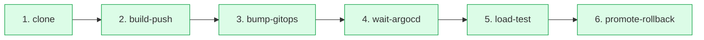
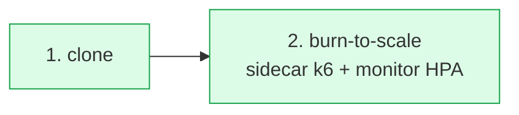

# belo-infrabase-k3d

Stack completo de CI/CD y deployment strategies sobre Kubernetes local con **k3d**.
Demuestra BlueGreen, Canary y RollingUpdate con ArgoRollouts, GitOps con ArgoCD, y dos pipelines Tekton:

- **Release pipeline** (6 stages): desde `git push tag` hasta `Rollout Healthy` con la nueva imagen activa, sin intervención manual. El Stage 6 (promote/rollback) es el dueño de la verdad del release.
- **Burn pipeline** (2 stages, on-demand): valida que el HPA escala bajo carga. Se dispara con tag `refs/tags/burn/<env>` o `make burn-test`. Vive separado del release porque los capacity tests son ortogonales al despliegue funcional.

**Run end-to-end típico del release** (cold cache): clone (10s) → kaniko build+push (31s) → bump-gitops (11s) → wait-argocd (23s) → k6 load-test 1000 VUs (~2m) → promote-rollback (11s) = **~3m** desde el push del tag hasta la nueva versión sirviendo 100% del tráfico. Cada PipelineRun se nombra `<app>-pipelinerun-<tag>` (ej: `webserver-api01-pipelinerun-v1.2.0`).

**Run del burn pipeline**: ~3-4min de CPU saturada. Disparalo cuando quieras (post-tunear HPA, antes de un evento de tráfico alto, weekly check, etc.) — no en cada release.

Para entender **qué hace cada stage del pipeline de release, cómo se garantiza que el load test corra sobre la versión nueva, por qué el circuito de promote/rollback es correcto para BG y Canary, y por qué el burn vive en pipeline separado**, leer [docs/pipeline-stages.md](docs/pipeline-stages.md).

---

## Índice

- [POC playbook end-to-end](#poc-playbook-end-to-end)
- [Stack de tecnologías](#stack-de-tecnologías)
- [Pre-requisitos](#pre-requisitos)
- [Levantado desde cero](#levantado-desde-cero)
- [Acceso a los dashboards](#acceso-a-los-dashboards)
- [Configurar el webhook](#configurar-el-webhook)
- [Correr el pipeline](#correr-el-pipeline)
- [Stages del pipeline](#stages-del-pipeline)
- [Deployment strategies](#deployment-strategies)
- [Estructura del repo](#estructura-del-repo)
- [Troubleshooting](#troubleshooting)
- [Documentación adicional](#documentación-adicional)

---

## POC playbook end-to-end

Flujo testeado para hacer la demo completa en una sesión. Asume cluster ya levantado (`make cluster-up`, secretos aplicados, `make bootstrap`).

### Paso 0 — Sincronizar todo con la última versión del repo

```bash
git pull origin main
make refresh   # re-aplica Tekton tasks/pipelines/triggers + dashboards + fluent-bit
make pipeline-check   # verificar que los triggers github-tag-release y github-tag-burn están registrados
```

> Si `pipeline-check` no muestra los DOS triggers, algo del `make tekton-apply` no quedó aplicado. Volvé a correr `make tekton-apply`.

### Paso 1 — Demo BlueGreen (api01)

Desde el repo `webserver-api01`:

```bash
cd /ruta/a/webserver-api01
git pull origin main
# Bumpear la version local SOLO en una rama de prueba o como tag
git tag release/v0.6.0/dev
git push origin release/v0.6.0/dev
```

**Mientras corre**, abrí 3 cosas:
- Tekton Dashboard: http://tekton.localhost:8888/#/namespaces/tekton-pipelines/pipelineruns/webserver-api01-pipelinerun-v0.6.0 — ver tree view de las 6 stages
- Rollout en vivo: `kubectl argo rollouts get rollout webserver-api01-dev -n webserver-api01-dev --watch`
- Grafana dashboard "webserver-api01 — request, latency, HPA": http://grafana.localhost:8888/d/belo-api01

**Resultado esperado** (~3 min):
- Stage 4 lleva el Rollout a `Paused` con 2 pods stable (blue) + 2 pods preview (green)
- Stage 5 corre 1000 VUs contra preview. HPA puede escalar a 3-4 replicas
- Stage 6 patchea `pauseConditions=null` → switchover blue → green
- 30s después blue scale-down → solo green sirve
- `curl http://api01.localhost:8888/api01/version` devuelve v0.6.0

### Paso 2 — Demo Canary (api02)

Desde el repo `webserver-api02`:

```bash
cd /ruta/a/webserver-api02
git pull origin main
git tag release/v0.6.0/dev
git push origin release/v0.6.0/dev
```

**Mientras corre**:
- Tekton Dashboard
- Rollout: `kubectl argo rollouts get rollout webserver-api02-dev -n webserver-api02-dev --watch`
- Mostrar el split de tráfico: `for i in $(seq 1 30); do curl -s http://api02.localhost:8888/api02/version | jq -r .version; done | sort | uniq -c`

**Resultado esperado**:
- Rollout sube canary a 5% → pausa → 25% → pausa → 50% → pausa
- Stage 5 corre k6 contra stable (que tiene el split de tráfico) — algunos requests caen en canary, otros en stable
- Stage 6 patchea `promoteFull=true` → canary va a 100%

### Paso 3 — Burn pipeline (HPA capacity test)

Después de los releases, validar que el HPA funciona bajo carga:

```bash
# Vía tag (webhook):
cd /ruta/a/webserver-api01
git tag burn/dev
git push origin burn/dev

# O manual sin webhook:
make burn-test APP=webserver-api01 ENV=dev
```

**Mientras corre** (180s):
- Observar HPA: `kubectl get hpa webserver-api01-dev -n webserver-api01-dev -w`
- Logs del pipeline: `tkn pipelinerun logs -n tekton-pipelines -l pipeline=burn --last -f`
- Grafana panel "HPA replicas (current vs desired)"

**Resultado esperado**: HPA escala de 2 → 3-4 replicas. El PipelineRun termina con `outcome=passed`.

### Paso 4 — Mostrar observabilidad

- **Kibana** (http://kibana.localhost:8888): crear index pattern `k8s-*`, Discover → query `kubernetes.namespace_name : "webserver-api01-dev" and path : "/api01/hello"` → ver requests reales del load test en JSON.
- **Grafana**: dashboards `belo-api01`, `belo-api02`, `belo-pipeline`. Mostrar p95/p99, HPA scale events, Tekton TaskRun durations.

### Paso 5 — Mostrar rollback automático (opcional, si hay tiempo)

Pushear un tag a una versión con bug intencional:

```bash
# En el repo de la app, romper algo (e.g. comentar el endpoint /api01/health)
# Commit, push, tag:
git tag release/v0.6.1/dev
git push origin release/v0.6.1/dev
```

El probe falla → Stage 4 timeout (rollout no llega a Paused saludable) o Stage 5 falla con thresholds → Stage 6 aborta → stable queda intacto sirviendo v0.6.0.

---

---

## Stack de tecnologías

| Capa | Tecnología |
|------|-----------|
| Kubernetes local | k3d (k3s en Docker) |
| Deployment strategies | Argo Rollouts — BlueGreen, Canary, RollingUpdate |
| GitOps | ArgoCD (apps-of-apps) |
| CI/CD | Tekton Pipelines + Triggers |
| **CI/CD UI** | **Tekton Dashboard (equivalente a OpenShift Pipelines)** |
| Build de imágenes | Kaniko (sin Docker daemon) |
| Ingress | nginx-ingress (NodePort :8888→:80) |
| Logging | EFK — Elasticsearch + Fluent-bit + Kibana |
| Monitoring | kube-prometheus-stack — Prometheus + Grafana |
| Dashboard general | Headlamp |
| Load testing | k6 (in-cluster) |
| Apps de demo | Python FastAPI + structlog + prometheus-client |
| Packaging | Helm (chart maestro `pythonapps`) |
| Storage | local-path (provisioner nativo de k3s) |

---

## Pre-requisitos

| Herramienta | Versión mínima | Instalación en Windows |
|-------------|----------------|------------------------|
| Docker Desktop | 24+ | https://docs.docker.com/get-docker/ |
| k3d | v5.6+ | `winget install k3d` |
| kubectl | 1.28+ | `winget install Kubernetes.kubectl` |
| helm | v3.14+ | `winget install Helm.Helm` |
| make | cualquiera | incluido en Git Bash / `winget install GnuWin32.Make` |
| k6 (opcional) | v0.50+ | `winget install k6` |
| tkn CLI (opcional) | latest | `winget install tektoncd.cli` |
| ngrok (para webhook) | **v3.20+** | `winget install ngrok.ngrok` |

> **Importante sobre ngrok:** la cuenta gratuita ahora exige cliente ≥ 3.20.0. Si ya lo tenías instalado, actualizá con `ngrok update`.
>
> **Recursos mínimos**: 8 GB RAM, 4 CPU cores, 20 GB de disco libre.
>
> **Windows**: después de instalar k3d con winget, reiniciá la terminal para que el PATH se actualice.
> Si usás `make` desde Git Bash, todos los comandos de esta guía asumen Git Bash o WSL2.
>
> **Docker Desktop debe estar corriendo** antes de cualquier comando. Si `k3d cluster list` da error de conexión, abrí Docker Desktop y esperá a que esté activo.
>
> **Token de DockerHub**: creá un Access Token en hub.docker.com → Account Settings → Security (no uses la contraseña directamente).

---

## Levantado desde cero

> **Antes de empezar**: asegurate de que Docker Desktop esté corriendo. Sin el daemon de Docker activo, k3d no puede crear el cluster.

```bash
# 1. Clonar este repo
git clone https://github.com/Valentino-33/belo-infrabase-k3d
cd belo-infrabase-k3d

# 2. Crear el cluster k3d e instalar todos los addons (~10-15 min)
make cluster-up
```

```bash
# 3. Crear los secretos necesarios para el pipeline
make secrets-apply \
  DOCKERHUB_USER=<tu-usuario-dockerhub> \
  DOCKERHUB_TOKEN=<tu-token-dockerhub> \
  GITHUB_TOKEN=<tu-personal-access-token>
```

```bash
# 4. Publicar las imágenes iniciales en Docker Hub
#    (ArgoCD las necesita para levantar los pods la primera vez)
docker login -u <tu-usuario-dockerhub> --password-stdin <<< "<tu-token-dockerhub>"
make images-initial DOCKERHUB_USER=<tu-usuario-dockerhub>
```

```bash
# 5. Bootstrap: aplicar root Application de ArgoCD + manifests de Tekton + dashboards Grafana
make bootstrap
```

```bash
# 6. Verificar el estado (esperar ~2 min después del bootstrap)
make cluster-status
make cluster-info
```

> El Tekton Dashboard (UI visual de los PipelineRuns) y los dashboards de Grafana ya quedan instalados como parte de `make addons` + `make bootstrap`. No hay paso manual extra.

Después de `make bootstrap`, ArgoCD sincroniza las apps automáticamente. En ~2 minutos todos los pods deben estar corriendo:

```bash
kubectl -n argocd get applications
# NAME                   SYNC STATUS   HEALTH STATUS
# apps-of-apps           Synced        Healthy
# gitops-core-dev        Synced        Healthy
# webserver-api01-dev    Synced        Healthy
# webserver-api02-dev    Synced        Healthy

# Cada app vive en su propio namespace = <app>-<env>
kubectl -n webserver-api01-dev get pods
# NAME                                   READY   STATUS    RESTARTS   AGE
# webserver-api01-dev-xxx-xxx            1/1     Running   0          2m
```

> **Nota sobre Kibana**: el pod de Kibana puede tardar hasta 3-5 minutos en responder luego de que aparezca como `Running`. Es normal — el proceso de inicialización de Kibana 8.x es lento.
>
> **Nota sobre `make all`**: hace `cluster-up + bootstrap` en un solo comando, pero **omite** el paso de secretos y el push de imágenes iniciales. Corré siempre los pasos 3 y 4 antes o las apps van a quedar en `ImagePullBackOff`.

---

## Acceso a los dashboards

### 1. Agregar entradas al archivo hosts

Editar `C:\Windows\System32\drivers\etc\hosts` **como Administrador**:

```
127.0.0.1 argocd.localhost
127.0.0.1 grafana.localhost
127.0.0.1 kibana.localhost
127.0.0.1 headlamp.localhost
127.0.0.1 tekton.localhost
127.0.0.1 api01.localhost
127.0.0.1 preview-api01.localhost
127.0.0.1 api02.localhost
127.0.0.1 preview-api02.localhost
127.0.0.1 tekton-webhook.localhost
```

### 2. Abrir en el browser

Todos los servicios son accesibles en el puerto **:8888** a través de nginx-ingress:

| Servicio | URL | Credenciales |
|----------|-----|--------------|
| **ArgoCD** | http://argocd.localhost:8888 | admin / `make argocd-password` |
| **Tekton Dashboard** | http://tekton.localhost:8888 | — (tree view de PipelineRuns) |
| **Grafana** | http://grafana.localhost:8888 | admin / belo-challenge |
| **Kibana** | http://kibana.localhost:8888 | sin autenticación (dev) |
| **Headlamp** | http://headlamp.localhost:8888 | token: ver abajo |
| **api01** (stable) | http://api01.localhost:8888 | — |
| **api01** (preview) | http://preview-api01.localhost:8888 | — |
| **api02** (stable) | http://api02.localhost:8888 | — |
| **api02** (preview) | http://preview-api02.localhost:8888 | — |
| **Tekton webhook** | http://tekton-webhook.localhost:8888 | configurar en GitHub |

**Token de Headlamp** (expira en 1 hora):

```bash
kubectl create token headlamp --namespace kube-system
```

### Tekton Dashboard — visualización de PipelineRuns

Es el equivalente exacto a la sección **Pipelines / PipelineRuns** de OpenShift Console (que internamente *es* Tekton). Provee:

- Listado completo de PipelineRuns con status badges en vivo
- **Tree/DAG view** de las stages con dependencias
- Logs streaming por step
- Botones de retry/cancel
- Detalle de Tasks, TriggerTemplates, EventListeners

**Nombre del PipelineRun (determinístico):** cada run se crea con el nombre `<app>-pipelinerun-<image-tag>`. Por ejemplo, pushear `release/v1.2.0/dev` desde el repo `webserver-api01` crea el run `webserver-api01-pipelinerun-v1.2.0`. Esto hace trivial identificar qué deploy corresponde a cada run en el dashboard, en `kubectl get pipelinerun`, o en los nombres de pods de TaskRuns (e.g., `webserver-api01-pipelinerun-v1.2.0-build-push-pod`).

> Re-pushear el mismo tag falla con `AlreadyExists` — usá un semver nuevo o eliminá el run anterior con `kubectl delete pipelinerun <name> -n tekton-pipelines`.

Direct links útiles:
- Lista: http://tekton.localhost:8888/#/pipelineruns
- Detalle de un run: http://tekton.localhost:8888/#/namespaces/tekton-pipelines/pipelineruns/webserver-api01-pipelinerun-v1.2.0

---

## Configurar el webhook

Para que el pipeline se dispare automáticamente al pushear un tag de Git, necesitás exponer el EventListener de Tekton a internet.

### Opción rápida — ngrok

```bash
# Iniciar tunnel (deja una terminal corriendo)
make tunnel

# ngrok muestra: Forwarding https://abc123.ngrok-free.app → http://localhost:8888
# (--host-header=tekton-webhook.localhost ya viene seteado en el Makefile,
#  para que nginx-ingress sepa rutear al EventListener correcto)
```

En GitHub → repo de la app → **Settings → Webhooks → Add webhook**:
- **Payload URL**: `https://abc123.ngrok-free.app`
- **Content type**: `application/json`
- **Events**: `Just the push event` (cubre push de tags)

Ver la [guía completa de webhook](docs/webhook-setup.md) para otras opciones (smee.io, IP directa, HMAC).

---

## Correr el pipeline

### Automático (vía webhook + git tag)

El formato del tag que dispara el pipeline es **`refs/tags/release/<semver>/<envs>[/loadtest=<bool>]`**:

```bash
# Ir al repo de la app (debe llamarse igual que el app-name en ArgoCD)
cd /ruta/a/webserver-api01

# Release rápido (sin load-test, default conservador)
git tag release/v1.2.0/dev
git push origin release/v1.2.0/dev

# Release con load-test k6 explícito (corre ~3min de carga, deja HPA scale visible)
git tag release/v1.2.0/dev/loadtest=true
git push origin release/v1.2.0/dev/loadtest=true

# Tag multi-env (envs separados por coma)
git tag release/v1.2.0/dev,staging
git push origin release/v1.2.0/dev,staging
```

El CEL interceptor del EventListener filtra el push, extrae `image_tag`, `environments` y `run_load_test`, y crea el PipelineRun. La estrategia (bluegreen/canary/rollingupdate) **NO** se pasa por el tag — viene del valor `rollout.strategy` del chart Helm de la app, y el pipeline la auto-detecta inspeccionando el Rollout en vivo.

| Tag pusheado | `image_tag` | `environments` | `run_load_test` | Dispara pipeline |
|--------------|-------------|----------------|-----------------|------------------|
| `release/v1.0.0/dev` | `v1.0.0` | `dev` | `false` (default) | ✅ — release rápido |
| `release/v1.0.0/dev/loadtest=true` | `v1.0.0` | `dev` | `true` | ✅ — corre k6 |
| `release/v1.0.0/dev/loadtest=false` | `v1.0.0` | `dev` | `false` (explícito) | ✅ — release rápido |
| `release/v1.0.0/dev,staging` | `v1.0.0` | `dev,staging` | `false` | ✅ |
| `v1.0.0` | — | — | — | ❌ formato inválido |
| `release/v1.0.0` | — | — | — | ❌ falta env |

> **Sobre el flag `loadtest`**: el default es `false` deliberadamente — el load-test fuerza HPA scale durante el Rollout, lo que "ensucia" la visualización de la estrategia (BG/Canary) en la demo. Para validar capacidad bajo carga existe un pipeline aparte (`refs/tags/burn/<env>`) que es independiente del release.

> **Importante**: el nombre del repo de la app en GitHub debe coincidir con el `app-name` en ArgoCD (`webserver-api01` / `webserver-api02`) — el TriggerBinding lo extrae de `body.repository.name`.

### Manual (sin webhook)

```bash
# Sin pushear tags — crea un PipelineRun directamente
make pipeline-run APP=webserver-api01 TAG=v1.2.0

# Monitorear (CLI tkn)
tkn pipelinerun logs -n tekton-pipelines --last -f

# O visualmente en el dashboard
# http://tekton.localhost:8888/#/pipelineruns
```

### Correr el burn pipeline (HPA capacity test)

Pipeline aparte del release, on-demand. Útil para validar HPA después de tunear `targetCPUUtilization` o `maxReplicas`, antes de un evento de tráfico alto, o como check semanal del platform team.

**Vía webhook** (desde el repo de la app):
```bash
cd /ruta/al/repo/de/la/app
git tag burn/dev
git push origin burn/dev
```

El segundo trigger del EventListener (`github-tag-burn`) filtra el tag `refs/tags/burn/<env>` y crea un PipelineRun llamado `<app>-burn-<env>-<random>` (generateName — re-correr el mismo env es seguro, cada push genera un run nuevo).

**Manual** (sin webhook):
```bash
make burn-test APP=webserver-api01 ENV=dev
# Observar HPA en paralelo:
kubectl get hpa webserver-api01-dev -n webserver-api01-dev -w
```

Outcome del burn:
- `passed`: HPA escaló de N → M replicas (con M > N) en algún momento de la ventana de 180s. Capacidad validada.
- `failed`: replicas nunca subieron — revisar `targetCPUUtilization`, `resources.limits.cpu`, o si `hpa.enabled=true`.
- `skipped`: corrió en production, no quemamos prod por defecto.

Más detalle: [docs/pipeline-stages.md → Pipeline auxiliar — burn-to-scale](docs/pipeline-stages.md#pipeline-auxiliar--burn-to-scale-capacity-test).

---

## Stages del pipeline de release

Las **6 stages** del pipeline `pythonapps-pipeline` (definido en `charts/pythonapps/templates/pipeline-templates/pipeline-pythonapps.yaml`):



| # | Task | Image | Qué hace | Output / Result |
|---|------|-------|----------|------------------|
| 1 | `git-clone-app` | `alpine/git` | `git clone --depth 1` del repo de la app al workspace `source` en la ref del tag | Código en `/workspace/source/src` |
| 2 | `kaniko-build-push` | `gcr.io/kaniko-project/executor` | Build de `src/Dockerfile` + push a Docker Hub como `<user>/<app>:<tag>` | Imagen publicada |
| 3 | `bump-gitops-image` | `alpine/git` + `mikefarah/yq` | Clone del repo gitops, `yq` setea `image.tag` en el `values.yaml` de cada env, commit + push | **Result: `commit-sha`** (full SHA del bump commit) |
| 4 | `wait-argocd-sync` | `bitnami/kubectl` | (a) Force-refresh ArgoCD app; (b) Espera `.status.sync.revision == commit-sha`; (c) Auto-detecta strategy; (d) Espera `Rollout.spec.image-tag == <tag>` Y `phase=Paused` (BG/Canary) o `phase=Healthy` (Rolling). **Esta task es la que garantiza que Stage 5 corre sobre la versión nueva** | **Results: `primary-env`, `strategy`** |
| 5 | `run-load-test` | `grafana/k6` | k6 (1000 VUs ramp + sustained) contra preview/canary según strategy. Lee el script desde el repo de la app (`loadtest/`). **Fail-fast** si el script no existe. Thresholds p95<2s, p99<3s, errors<5% (laxos a propósito — solo falla en regresión real) | **Result: `outcome`** = `passed` \| `failed` |
| 6 | `promote-or-rollback` | `bitnami/kubectl` | Patches directos a la spec/status del Rollout:<br/>• BG passed → `status.pauseConditions=null` → `phase=Healthy`<br/>• Canary passed → `status.promoteFull=true` → `phase=Healthy`<br/>• Cualquier failed → `spec.abort=true` → `phase=Degraded` | — |

### Pipeline auxiliar — burn-to-scale (capacity test on-demand)

`pythonapps-burn-pipeline` se dispara con tag `refs/tags/burn/<env>` (e.g. `burn/dev`) o con `make burn-test APP=x ENV=dev`. Vive separado del release pipeline para no contaminar el promote con tests lentos que cambian raramente. Detalles en [docs/pipeline-stages.md → Pipeline auxiliar](docs/pipeline-stages.md#pipeline-auxiliar--burn-to-scale-capacity-test).



### Contrato del repo de la app — scripts de load test

El Stage 5 lee los scripts k6 desde el **repo de la app**, no desde este repo. El repo de la app debe tener:

```
<app-repo>/                 (e.g. github.com/Valentino-33/webserver-api01)
├── Dockerfile              ← usado por Stage 2 (kaniko)
├── app/                    ← código fuente
├── loadtest/               ← scripts k6 (uno por strategy posible)
│   ├── smoke.js
│   ├── load-bluegreen.js   ← si rollout.strategy = bluegreen
│   └── load-canary.js      ← si rollout.strategy = canary
└── pyproject.toml
```

| strategy del Helm chart | Script Stage 5 (release pipeline) | Script Burn pipeline (on-demand) |
|-------------------------|-----------------------------------|----------------------------------|
| `bluegreen` | `loadtest/load-bluegreen.js` | `loadtest/burn-to-scale.js` |
| `canary` | `loadtest/load-canary.js` | `loadtest/burn-to-scale.js` |
| `rollingupdate` | `loadtest/smoke.js` | `loadtest/burn-to-scale.js` |

**Si el script no existe, el pipeline falla ruidosamente** (exit 1). Esto previene que cambiar la strategy del chart sin tener el load test correspondiente termine en un "verde fantasma". Si querés que la app soporte cualquier strategy futura, agregá los 3 scripts. El `burn-to-scale.js` es requerido por el burn pipeline cualquiera sea la strategy.

El task pasa al script las env vars `BASE_URL` y `PREVIEW_URL` apuntando a los services internos del cluster (`<release>-stable.<ns>.svc:8080` / `<release>-preview.<ns>.svc:8080`). Los fallbacks hardcodeados en los .js solo se usan para corridas locales (`make load-test-*`).

### Por qué Stage 4 es así (race condition fix)

ArgoCD pollea su repo gitops cada ~3 minutos por default. Sin forzar refresh, el step `wait-argocd` puede ver el sync.revision **viejo** como `Synced` y avanzar — el load test correría contra la versión anterior, y `promote-rollback` haría no-op sobre un Rollout ya `Healthy`. El pipeline reportaría todo verde sin haber desplegado nada.

La fix:
1. `bump-gitops` emite el SHA del commit como Task result.
2. `wait-argocd` recibe ese SHA como param, hace `kubectl annotate app ... argocd.argoproj.io/refresh=normal` para forzar polling inmediato, y espera que ArgoCD reporte ese SHA específico como `sync.revision`.
3. Step 2 además verifica que el Rollout spec ya tenga el `image-tag` esperado y esté `phase=Paused` (BG/Canary) — eso garantiza que el green/canary RS está ready para el load test.

### Por qué Stage 6 patchea directo y no usa el plugin

El plugin `kubectl argo rollouts promote` reportaba éxito pero el Rollout volvía a `BlueGreenPause` ~10s después (causa exacta sin aislar — posiblemente race con ArgoCD reaplicando el manifest). Los patches directos al `status.pauseConditions=null` o `status.promoteFull=true` (los mismos que el plugin emite internamente, según [su código fuente](https://github.com/argoproj/argo-rollouts/blob/master/cmd/kubectl-argo-rollouts/commands/promote.go)) **son persistentes**. Además, eliminar el download del plugin reduce ~15s del pipeline y elimina una dependencia externa.

---

## Deployment strategies

La strategy de cada app está fijada en su `values.yaml` (campo `rollout.strategy`) y el chart Helm renderiza el `kind: Rollout` correspondiente. El pipeline auto-detecta la strategy en vivo y aplica el comportamiento correcto en `wait-argocd` y `promote-rollback`.

### Blue/Green — webserver-api01

La nueva versión (Green) se despliega en paralelo al stable (Blue). El tráfico no cambia hasta que el k6 pase y Stage 6 ejecute el promote.

```bash
# Guía interactiva
make demo-bluegreen

# Monitorear el rollout
kubectl argo rollouts get rollout webserver-api01-dev -n webserver-api01-dev --watch

# Verificar que el preview responde
curl http://preview-api01.localhost:8888/version

# El pipeline promueve automáticamente si k6 pasa.
# Si querés hacerlo a mano (equivalente al patch que hace el pipeline):
kubectl patch rollout webserver-api01-dev -n webserver-api01-dev \
  --subresource=status --type=merge -p '{"status":{"pauseConditions":null}}'

# Rollback (abort)
kubectl patch rollout webserver-api01-dev -n webserver-api01-dev \
  --type=merge -p '{"spec":{"abort":true}}'
```

### Canary — webserver-api02

El tráfico se mueve gradualmente: **5% → 25% → 50% → promote-full** con k6 en cada step (cuando se corre con multi-step, ver chart). En el pipeline actual, `promote-full` lleva el canary a 100% de una si k6 pasó.

```bash
# Guía interactiva
make demo-canary

# Monitorear la distribución de tráfico en vivo
kubectl argo rollouts get rollout webserver-api02-dev -n webserver-api02-dev --watch

# Avanzar a 100% manualmente (lo que hace el pipeline)
kubectl patch rollout webserver-api02-dev -n webserver-api02-dev \
  --subresource=status --type=merge -p '{"status":{"promoteFull":true}}'

# Rollback
kubectl patch rollout webserver-api02-dev -n webserver-api02-dev \
  --type=merge -p '{"spec":{"abort":true}}'
```

### RollingUpdate — opcional

Deployment estándar. Los pods se actualizan uno a uno sin pauses. El pipeline corre un smoke test al final y aborta si falla.

---

## Estructura del repo

```
belo-infrabase-k3d/
├── Makefile                            ← Entrada principal (make help)
├── k3d/
│   └── config.yaml                     ← Definición del cluster k3d (4 nodos)
│   ★ El código de las apps NO vive en este repo. Single source of truth:
│     - github.com/Valentino-33/webserver-api01 (loadtest/ + app/ + Dockerfile)
│     - github.com/Valentino-33/webserver-api02 (loadtest/ + app/ + Dockerfile)
│     `make images-initial` clona estos repos a /tmp y buildea desde ahí.
│     `make build APP=...` también clona del repo externo.
├── charts/
│   └── pythonapps/                     ← Helm chart maestro
│       ├── templates/
│       │   ├── rollout.yaml            ← ArgoRollout (BG/Canary/Rolling según values.rollout.strategy)
│       │   ├── service.yaml            ← stable + preview (siempre)
│       │   ├── ingress.yaml            ← stable + preview (siempre)
│       │   ├── hpa.yaml
│       │   ├── servicemonitor.yaml
│       │   └── pipeline-templates/     ← Tekton Tasks, Pipeline, Triggers
│       │       ├── tekton-sa.yaml          ← SAs + ClusterRoles (patch rollouts/status, applications)
│       │       ├── task-clone.yaml
│       │       ├── task-build-kaniko.yaml
│       │       ├── task-bump-gitops.yaml   ← emite result `commit-sha`
│       │       ├── task-wait-argocd.yaml   ← espera revision específica + image-tag + phase=Paused
│       │       ├── task-load-test.yaml
│       │       ├── task-promote-rollback.yaml  ← kubectl patch directo (sin plugin)
│       │       ├── pipeline-pythonapps.yaml
│       │       ├── trigger-binding.yaml
│       │       ├── trigger-template.yaml
│       │       └── event-listener.yaml
│       └── apps/
│           ├── webserver-api01/
│           │   ├── build-time/app.yaml ← ArgoCD Application + Helm chart wiring
│           │   └── dev/values.yaml     ← image.tag actualizado por el pipeline
│           └── webserver-api02/
│               ├── build-time/app.yaml
│               └── dev/values.yaml
├── gitops/
│   ├── apps-of-apps.yaml               ← Root Application de ArgoCD
│   └── gitops-core-dev/
│       ├── webserver-api01.yaml        ← Application CR (apunta a charts/pythonapps)
│       └── webserver-api02.yaml
├── helm/addons/                        ← Values de cada addon Helm
│   ├── argocd/values.yaml
│   ├── nginx-ingress/values.yaml
│   ├── elasticsearch/values.yaml
│   ├── fluent-bit/values.yaml
│   ├── kibana/values.yaml
│   ├── kube-prometheus/values.yaml
│   └── headlamp/values.yaml
├── manifests/
│   ├── argocd/bootstrap.yaml           ← Root Application (make bootstrap)
│   └── tekton/
│       ├── pipelinerun-manual.yaml     ← Pipeline manual sin webhook
│       ├── dashboard-ingress.yaml      ← Ingress para Tekton Dashboard en tekton.localhost
│       └── github-secret.yaml.example  ← Template de secret de GitHub
└── docs/
    ├── architecture.md                 ← Diagramas Mermaid de la arquitectura
    ├── pipeline-internals.md           ← Detalle técnico de cada Task del pipeline
    ├── security-and-rbac.md            ← PodSecurity, securityContext, ClusterRoles
    ├── troubleshooting.md              ← Gotchas detallados y soluciones
    ├── demo-guide.md                   ← Guía paso a paso de cada estrategia
    └── webhook-setup.md                ← Configuración del webhook GitHub → Tekton
```

---

## Troubleshooting

### Pipeline corre verde pero la imagen no se actualizó

Era el bug **del race condition**, ya corregido. Si volvés a verlo:
- Verificá que `task-bump-gitops` esté emitiendo el result `commit-sha`
- Verificá que el Pipeline pase `tasks.bump-gitops.results.commit-sha` y `params.image-tag` a `wait-argocd`
- Verificá que la SA `tekton-pipeline-runner` tenga verb `patch` sobre `applications` (necesario para el annotate refresh)

### kaniko falla con `PodAdmissionFailed`

El namespace `tekton-pipelines` tiene `pod-security.kubernetes.io/enforce` que rechaza pods con root. Kaniko **necesita** root.

```bash
# Verificar el label actual
kubectl get ns tekton-pipelines -o jsonpath='{.metadata.labels}'

# Si dice "restricted", bajalo a "baseline" (kaniko cumple baseline, no restricted)
kubectl label namespace tekton-pipelines pod-security.kubernetes.io/enforce=baseline --overwrite
```

> El bootstrap inicial deja `enforce=restricted` (viene del `release.yaml` oficial de Tekton). Las Tasks no-kaniko tienen su propio `stepTemplate.securityContext` compliant con `restricted`. Solo el namespace tiene que estar en `baseline`.

### bump-gitops falla con `URL rejected: Port number was not a decimal number`

Era el bug **del token-en-URL doble**, ya corregido. El step `commit-and-push` ahora usa `$(params.gitops-repo-url)` (pristine, sin auth) para construir el push URL, en vez de `git remote get-url origin` (que ya tiene el token del clone).

### Pods de la app en `ImagePullBackOff` al hacer bootstrap

Las imágenes `<dockerhub-user>/api01:latest` y `api02:latest` deben existir en Docker Hub **antes** de que ArgoCD haga el primer sync.

```bash
make images-initial DOCKERHUB_USER=<tu-usuario>
kubectl -n webserver-api01-dev delete pod --all   # fuerza re-pull
kubectl -n webserver-api02-dev delete pod --all
```

### El Rollout vuelve a `Paused` después del promote

Ver [troubleshooting.md → "Plugin promote no persiste"](docs/troubleshooting.md). Ya está mitigado en el pipeline actual (usa `kubectl patch` directo), pero si lo ves al promover manualmente desde la línea de comandos, usá el patch en vez del plugin:

```bash
kubectl patch rollout <name> -n <ns> --subresource=status --type=merge \
  -p '{"status":{"pauseConditions":null}}'
```

### ngrok: `Your ngrok-agent version is too old`

Las cuentas gratuitas ahora exigen ≥ 3.20.0:

```bash
ngrok update
# O si fue instalado con winget:
winget upgrade ngrok.ngrok
```

### EventListener `MinimumReplicasUnavailable`

Normal durante el primer minuto después de `make tekton-apply`. Esperá 60s y verificá:

```bash
kubectl -n tekton-pipelines get pods -l eventlistener=github-tag-listener
```

### Más

Ver [docs/troubleshooting.md](docs/troubleshooting.md) para los gotchas completos.

---

## Documentación adicional

| Documento | Descripción |
|-----------|-------------|
| [docs/pipeline-stages.md](docs/pipeline-stages.md) | **Stage-by-stage del pipeline + cómo se garantiza que el load test corre sobre la versión nueva + correctness de Blue/Green y Canary** |
| [docs/pipeline-internals.md](docs/pipeline-internals.md) | Detalle técnico por cada Task: image, results, params, comandos exactos |
| [docs/architecture.md](docs/architecture.md) | Diagramas Mermaid: topología del cluster, componentes y flujo CI/CD |
| [docs/logging-efk.md](docs/logging-efk.md) | **Formato de logs JSON + verificación end-to-end de EFK + queries útiles en Kibana** |
| [docs/grafana-dashboards.md](docs/grafana-dashboards.md) | **Cómo agregar dashboards nuevos a Grafana vía ConfigMaps (sidecar auto-load) + PromQL queries útiles** |
| [docs/security-and-rbac.md](docs/security-and-rbac.md) | PodSecurity Standards, securityContext en Tasks, ClusterRoles del pipeline runner |
| [docs/troubleshooting.md](docs/troubleshooting.md) | Gotchas detallados (race conditions, plugin issues, token quirks) con causa raíz y fix |
| [docs/demo-guide.md](docs/demo-guide.md) | Guía paso a paso para demostrar cada estrategia |
| [docs/webhook-setup.md](docs/webhook-setup.md) | Configuración del webhook GitHub → Tekton (ngrok, smee.io, HMAC) |
| [docs/daily-ops.md](docs/daily-ops.md) | Cómo apagar y encender el cluster cada día sin perder estado |
| [MAKEFILE_GUIDE.md](MAKEFILE_GUIDE.md) | Referencia completa de todos los targets del Makefile |
| [ROADMAP.md](ROADMAP.md) | Fases completadas y deuda técnica conocida |

---

## Comandos de referencia rápida

```bash
make help                                    # todos los targets
make cluster-up                              # crear cluster + instalar addons
make cluster-down                            # destruir todo
make cluster-status                          # nodos + apps + rollouts
make cluster-info                            # URLs, hosts, passwords
make secrets-apply DOCKERHUB_USER=x DOCKERHUB_TOKEN=x GITHUB_TOKEN=x
make bootstrap                               # aplicar ArgoCD root + Tekton
make tekton-apply                            # re-aplicar tasks/pipeline (si cambia el chart)
make argocd-password                         # password de ArgoCD
make pipeline-run APP=webserver-api01 TAG=v1.0.0
make demo-bluegreen                          # guía interactiva BlueGreen
make demo-canary                             # guía interactiva Canary
make rollout-status APP=webserver-api01      # estado en vivo
make rollout-promote APP=webserver-api01     # promover
make rollout-abort APP=webserver-api01       # rollback
make load-test-smoke APP=webserver-api01     # smoke test k6
make load-test-bluegreen                     # load test 1000 VUs contra preview
make load-test-canary                        # load test 1000 VUs canary
make burn-test APP=webserver-api01 ENV=dev   # burn pipeline (HPA capacity test)
make dashboards-apply                        # aplicar/recargar dashboards Grafana
make refresh                                 # re-aplicar Tekton + fluent-bit + dashboards sobre cluster ya up
make tunnel                                  # ngrok → exponer EventListener
make port-forward                            # port-forward de fallback
```
