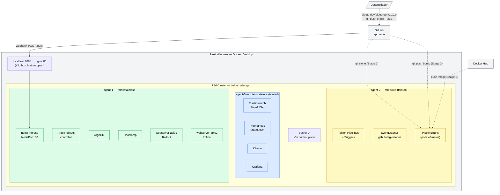
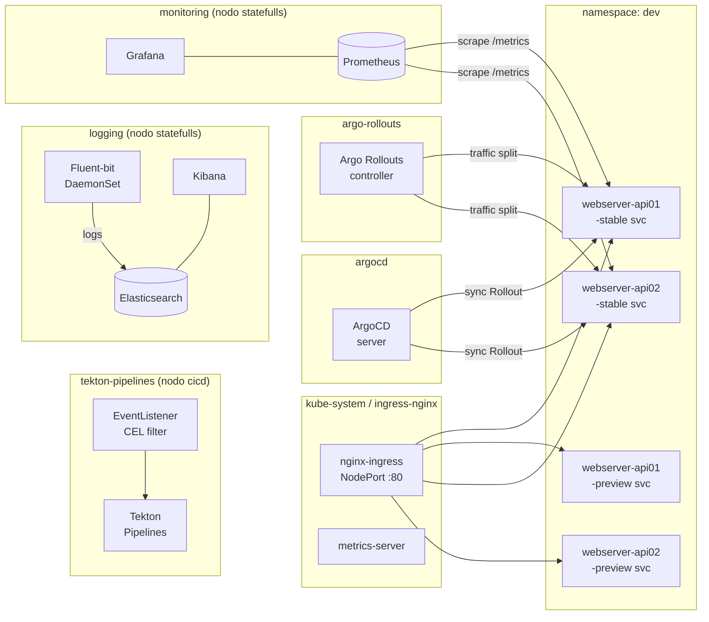
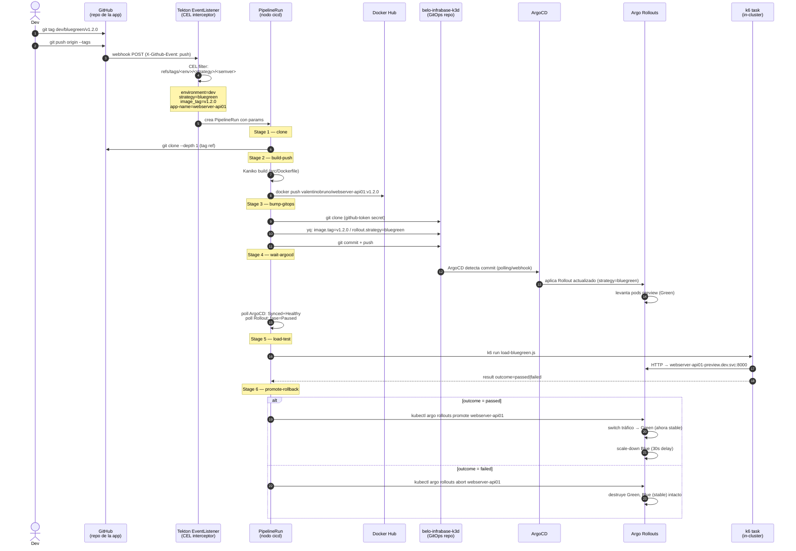

# Arquitectura — belo-infrabase-k3d

Este documento tiene tres diagramas: la **topología del cluster k3d**, los **componentes internos**, y el **flujo CI/CD completo**. GitHub renderiza Mermaid nativamente.

---

## 1. Topología del cluster k3d



### Mapa de cargas por nodo

| Nodo | Label | Taint | Cargas |
|------|-------|-------|--------|
| `server-0` | — | — | k3s control plane (etcd, API server) |
| `agent-0` | `role=statefulls` | `workload=statefulls:NoSchedule` | Elasticsearch, Prometheus, Kibana, Grafana |
| `agent-1` | `role=stateless` | — | nginx-ingress, ArgoCD, ArgoRollouts, api01, api02, Headlamp |
| `agent-2` | `role=cicd` | `workload=cicd:NoSchedule` | Tekton controller, EventListener, PipelineRuns (pods efímeros) |

> Los nodos con taint solo aceptan pods que declaren la toleration correspondiente.
> Los PipelineRuns llevan `toleration: workload=cicd` y `nodeSelector: role=cicd` en el TriggerTemplate.

---

## 2. Componentes internos del cluster



### Topología invariante (stable + preview siempre existen)

Para **las tres estrategias** (BlueGreen, Canary, RollingUpdate) se crean siempre los mismos recursos:

| Recurso | Nombre | Propósito |
|---------|--------|-----------|
| Service | `<app>-stable` | Tráfico productivo; objetivo del Ingress principal |
| Service | `<app>-preview` | Nueva versión antes del promote; objetivo del Ingress preview |
| Ingress | `<app>-stable` | `api01.localhost` → stable svc |
| Ingress | `<app>-preview` | `preview-api01.localhost` → preview svc |

Esto garantiza que las URLs de load test (`http://<app>-stable.<env>.svc.cluster.local:8000`) sean accesibles independientemente de la estrategia activa.

---

## 3. Flujo CI/CD completo



### Convención de tag

```
refs/tags/<env>/<strategy>/<semver>
```

El interceptor CEL filtra tags que cumplan exactamente esta forma (5 segmentos). Tags con otro formato no disparan ningún pipeline.

| Tag (lo que pusheás) | `environment` | `strategy` | `image_tag` |
|----------------------|---------------|------------|-------------|
| `dev/bluegreen/v1.2.0` | `dev` | `bluegreen` | `v1.2.0` |
| `dev/canary/v1.2.0` | `dev` | `canary` | `v1.2.0` |
| `dev/rollingupdate/v1.2.0` | `dev` | `rollingupdate` | `v1.2.0` |

> El `app-name` lo extrae el TriggerBinding de `body.repository.name` (nombre del repo de GitHub). Por eso el repo de la app **debe llamarse igual que el app-name** en el values de ArgoCD (`webserver-api01` / `webserver-api02`).

### Stages del pipeline

| # | Task Tekton | Qué hace |
|---|-------------|----------|
| 1 | `git-clone-app` | `git clone --depth 1` del repo de la app al workspace `source` |
| 2 | `kaniko-build-push` | Build de `src/Dockerfile` + push a Docker Hub |
| 3 | `bump-gitops-image` | yq: actualiza `image.tag` y `rollout.strategy` en values; commit + push al repo gitops |
| 4 | `wait-argocd-sync` | Poll hasta `ArgoCD Synced+Healthy` y Rollout en fase `Paused` (BG/Canary) o `Healthy` (Rolling) |
| 5 | `run-load-test` | k6 contra el endpoint correcto según strategy; emite result `outcome=passed\|failed`; siempre exits 0 |
| 6 | `promote-rollback` | BG: promote/abort; Canary: promote-full/abort; RollingUpdate: no-op/undo |

---

## 4. Estrategias de deployment

### Blue/Green — webserver-api01

```
         ANTES DEL PROMOTE
                │
    ┌───────────┴───────────┐
    │                       │
 stable-svc             preview-svc
 (Blue: v1.1)           (Green: v1.2)   ← k6 load-bluegreen.js
    │                       │
 100% tráfico           0% tráfico
                            │
               outcome=passed → promote
                            │
         DESPUÉS DEL PROMOTE
                │
    ┌───────────┴───────────┐
    │                       │
 stable-svc             preview-svc
 (Green: v1.2)          (Blue: v1.1 → scale-down 30s)
    │
 100% tráfico
```

### Canary — webserver-api02

```
           stable-svc              preview-svc
            (v1.1)                  (v1.2)
               │                       │
              95%        5%    ← step 1 (Paused — k6 corre)
              75%       25%    ← step 2 (Paused — k6 corre)
              50%       50%    ← step 3 (Paused — k6 corre)
               │               outcome=passed → promote --full
               └───────────────────────┘
                       100% (v1.2 es stable)
```

### RollingUpdate

```
 Rollout actualiza pods uno a uno (maxSurge 1, maxUnavailable 0).
 Completa directamente → fase Healthy (no Paused).
 Stage 5: k6 smoke.js contra el stable service.
 Stage 6: outcome=failed → kubectl rollout undo; outcome=passed → no-op.
```

---

## 5. Namespaces y distribución

| Namespace | Contenido | Nodo |
|-----------|-----------|------|
| `kube-system` | metrics-server, nginx-ingress, Headlamp | agent-1 |
| `argocd` | ArgoCD server + controller | agent-1 |
| `argo-rollouts` | Rollouts controller | agent-1 |
| `tekton-pipelines` | Tekton + Triggers + EventListener | agent-2 |
| `dev` | webserver-api01, webserver-api02 | agent-1 |
| `logging` | Elasticsearch, Fluent-bit, Kibana | agent-0 |
| `monitoring` | Prometheus, Grafana | agent-0 |

---

## 6. Deuda técnica conocida

- **Sin TLS local** — nginx usa HTTP. Para HTTPS local se puede usar cert-manager con un self-signed CA o mkcert.
- **GitHub PAT en Secret** — el token de push al repo gitops vive en un `Secret` de Kubernetes. En producción migrar a External Secrets Operator + vault/AWS Secrets Manager.
- **Single-node statefulls** — Elasticsearch y Prometheus sin HA. Suficiente para POC; para producción añadir replicas y anti-affinity.
- **Kaniko sin caché persistente** — cada build baja las capas base de nuevo. Agregar `--cache=true` con un registry local (e.g. `registry:2`) acelera builds en ~60%.
- **Sin análisis de métricas en rollout** — los Rollouts usan pauses manuales/pipeline. La siguiente mejora es añadir `AnalysisTemplate` con Prometheus para automatizar la decisión.
