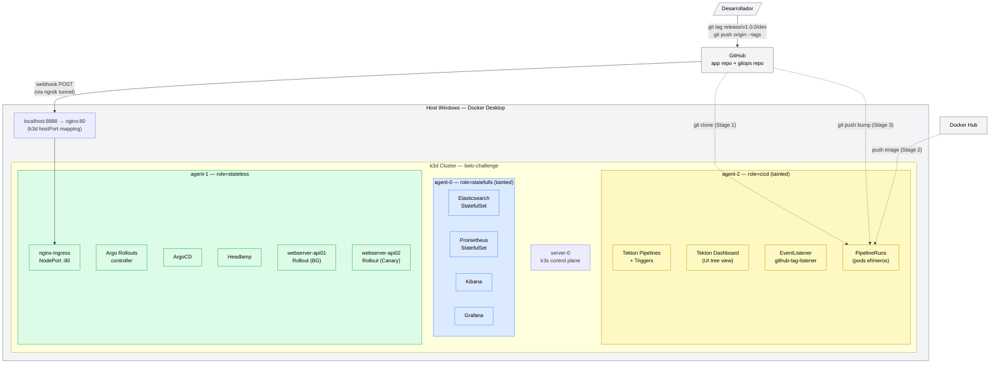
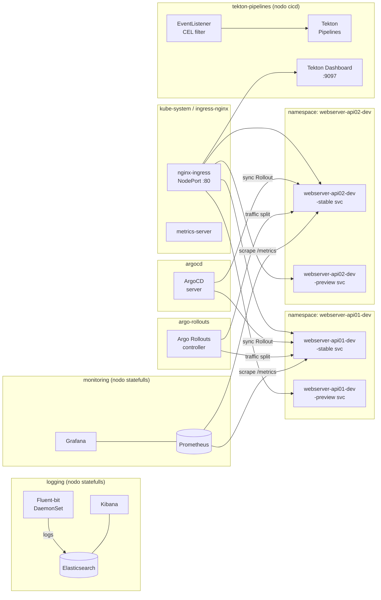
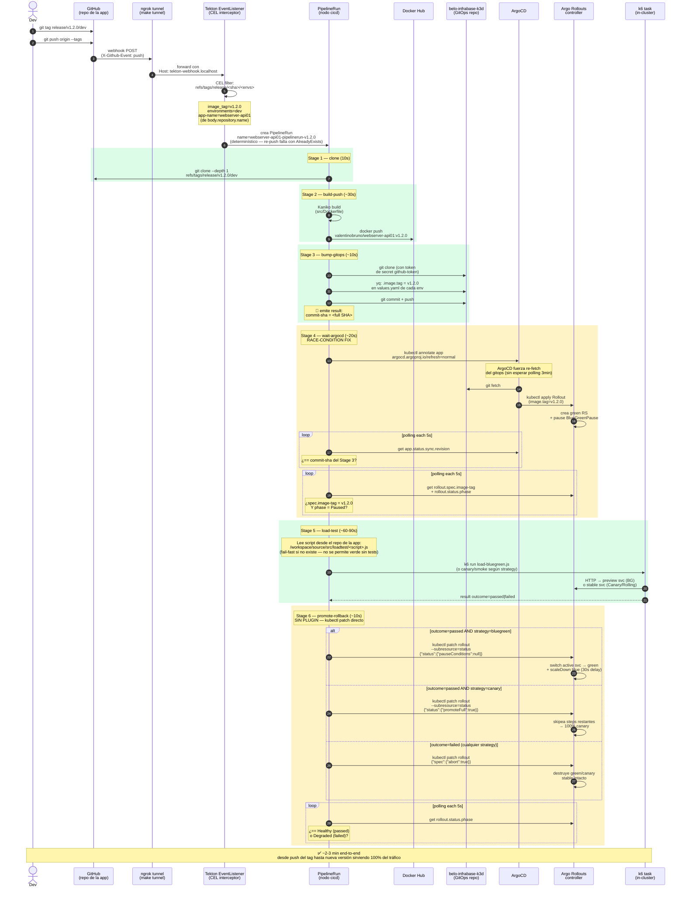

# Arquitectura — belo-infrabase-k3d

Este documento contiene cuatro diagramas: la **topología del cluster k3d**, los **componentes internos**, el **flujo CI/CD completo end-to-end** (con la fix del race condition), y el **modelo de promote-rollback**. GitHub renderiza Mermaid nativamente.

---

## 1. Topología del cluster k3d



### Mapa de cargas por nodo

| Nodo | Label | Taint | Cargas |
|------|-------|-------|--------|
| `server-0` | — | — | k3s control plane (etcd, API server) |
| `agent-0` | `role=statefulls` | `workload=statefulls:NoSchedule` | Elasticsearch, Prometheus, Kibana, Grafana |
| `agent-1` | `role=stateless` | — | nginx-ingress, ArgoCD, ArgoRollouts, api01, api02, Headlamp |
| `agent-2` | `role=cicd` | `workload=cicd:NoSchedule` | Tekton controller, Tekton Dashboard, EventListener, PipelineRuns (pods efímeros) |

> Los nodos con taint solo aceptan pods que declaren la toleration correspondiente.
> Los PipelineRuns llevan `toleration: workload=cicd` y `nodeSelector: role=cicd` en el TriggerTemplate.

---

## 2. Componentes internos del cluster



### Topología invariante (stable + preview siempre existen)

Para **las tres estrategias** (BlueGreen, Canary, RollingUpdate) se crean siempre los mismos recursos:

| Recurso | Nombre | Propósito |
|---------|--------|-----------|
| Service | `<app>-<env>-stable` | Tráfico productivo; objetivo del Ingress principal |
| Service | `<app>-<env>-preview` | Nueva versión antes del promote; objetivo del Ingress preview |
| Ingress | `<app>-<env>-stable` | `api01.localhost` → stable svc |
| Ingress | `<app>-<env>-preview` | `preview-api01.localhost` → preview svc |

Esto garantiza que las URLs de load test (`http://<app>-<env>-stable.<namespace>.svc.cluster.local:8000`) sean accesibles independientemente de la estrategia activa.

### Namespaces

| Namespace | Contenido | Nodo |
|-----------|-----------|------|
| `kube-system` | metrics-server, nginx-ingress, Headlamp | agent-1 |
| `argocd` | ArgoCD server + controller | agent-1 |
| `argo-rollouts` | Rollouts controller | agent-1 |
| `tekton-pipelines` | Tekton + Triggers + EventListener + Dashboard | agent-2 |
| `webserver-api01-dev` | Rollout, services, pods de api01 | agent-1 |
| `webserver-api02-dev` | Rollout, services, pods de api02 | agent-1 |
| `logging` | Elasticsearch, Fluent-bit, Kibana | agent-0 |
| `monitoring` | Prometheus, Grafana | agent-0 |

---

## 3. Flujo CI/CD completo (con race-condition fix)

Este diagrama refleja la implementación **actual** del pipeline profesional, incluyendo la fix del race condition ArgoCD ↔ Pipeline y el promote vía `kubectl patch` directo en lugar del plugin.



### Convención de tag (real)

```
refs/tags/release/<semver>/<envs>
```

| Segmento | Ejemplo | Cómo se usa |
|----------|---------|-------------|
| `refs/tags/release/` | literal | filtro del CEL interceptor |
| `<semver>` | `v1.2.0` | extraído a `image_tag` (Tekton param) — usado como Docker tag y como `image.tag` del values.yaml |
| `<envs>` | `dev` o `dev,staging` | extraído a `environments` — el bump escribe en el `values.yaml` de cada env listado |

| Tag pusheado | `image_tag` | `environments` | Dispara |
|--------------|-------------|----------------|---------|
| `release/v1.2.0/dev` | `v1.2.0` | `dev` | ✅ |
| `release/v1.2.0/dev,staging` | `v1.2.0` | `dev,staging` | ✅ |
| `v1.2.0` | — | — | ❌ |
| `release/v1.2.0` | — | — | ❌ falta env |

> **Importante**: el `app-name` lo extrae el TriggerBinding de `body.repository.name`. El repo de la app **debe llamarse igual que el app-name** en values de ArgoCD (`webserver-api01` / `webserver-api02`).
>
> La **strategy** (bluegreen / canary / rollingupdate) **NO** se pasa por el tag — viene fija del `rollout.strategy` del chart Helm de la app. El pipeline la auto-detecta inspeccionando el live Rollout.

### Stages del pipeline (resumen)

| # | Task Tekton | Image | Output principal |
|---|-------------|-------|------------------|
| 1 | `git-clone-app` | `alpine/git` | repo en `/workspace/source/src` |
| 2 | `kaniko-build-push` | `gcr.io/kaniko-project/executor` | imagen en Docker Hub |
| 3 | `bump-gitops-image` | `alpine/git` + `mikefarah/yq` | commit pusheado + **result `commit-sha`** |
| 4 | `wait-argocd-sync` | `bitnami/kubectl` | sync.revision verificado + Rollout en `Paused` con el image-tag correcto |
| 5 | `run-load-test` | `grafana/k6` | **result `outcome` = passed/failed** (1000 VUs, p95/p99 thresholds) |
| 6 | `promote-or-rollback` | `bitnami/kubectl` | Rollout `phase=Healthy` o `Degraded` (verificado) |
| 7 | `run-burn-to-scale` | sidecar `k6` + step `bitnami/kubectl` | **result `outcome` + `max-replicas`** — valida HPA scale-up |

> Ver detalle stage-por-stage y garantías de correctness en [docs/pipeline-stages.md](pipeline-stages.md).

### Naming convention del PipelineRun

Tanto el TriggerTemplate (webhook) como el manifest manual usan un nombre **determinístico**:

```
<app-name>-pipelinerun-<image-tag>
```

| Trigger | Nombre del PipelineRun |
|---------|------------------------|
| Webhook: push `release/v1.2.0/dev` desde repo `webserver-api01` | `webserver-api01-pipelinerun-v1.2.0` |
| Manual: `make pipeline-run APP=webserver-api01 TAG=v1.2.0` | `webserver-api01-pipelinerun-v1.2.0` |

Los TaskRuns generados por ese PipelineRun heredan el prefix automáticamente: `webserver-api01-pipelinerun-v1.2.0-clone`, `...-build-push`, `...-bump-gitops`, etc. Los pods de cada TaskRun también: `webserver-api01-pipelinerun-v1.2.0-build-push-pod`.

**Trade-off**: re-pushear el mismo tag falla con `AlreadyExists`. Esto es **intencional** — fuerza disciplina de semver (cada deploy un tag nuevo) y evita que un re-push silencioso sobrescriba el historial del pipeline. Para limpiar:

```bash
kubectl delete pipelinerun webserver-api01-pipelinerun-v1.2.0 -n tekton-pipelines
```

---

## 4. Modelo de promote-rollback (sin plugin)

Comparativa de los tres caminos del Stage 6 según strategy + outcome.

```mermaid
flowchart TB
    START[Stage 5 termina<br/>outcome = passed o failed]

    START --> STRAT{strategy?}

    STRAT -->|bluegreen| BG_O{outcome?}
    STRAT -->|canary| C_O{outcome?}
    STRAT -->|rollingupdate| R_O{outcome?}

    BG_O -->|passed| BG_P["kubectl patch rollout NAME<br/>--subresource=status --type=merge<br/>-p '{\"status\":{\"pauseConditions\":null}}'"]
    BG_O -->|failed| BG_F["kubectl patch rollout NAME<br/>--type=merge<br/>-p '{\"spec\":{\"abort\":true}}'"]

    C_O -->|passed| C_P["kubectl patch rollout NAME<br/>--subresource=status --type=merge<br/>-p '{\"status\":{\"promoteFull\":true}}'"]
    C_O -->|failed| C_F["kubectl patch rollout NAME<br/>--type=merge<br/>-p '{\"spec\":{\"abort\":true}}'"]

    R_O -->|passed| R_P[no-op<br/>RollingUpdate completa solo]
    R_O -->|failed| R_F["kubectl patch rollout NAME<br/>--type=merge<br/>-p '{\"spec\":{\"abort\":true}}'"]

    BG_P --> VERIFY_OK[verifica phase=Healthy<br/>timeout 180s]
    C_P --> VERIFY_OK
    R_P --> VERIFY_OK

    BG_F --> VERIFY_KO[verifica phase=Degraded<br/>timeout 180s]
    C_F --> VERIFY_KO
    R_F --> VERIFY_KO

    VERIFY_OK --> END_OK[Pipeline ✅]
    VERIFY_KO --> END_KO[Pipeline ✅<br/>rollback efectivo]

    classDef patch fill:#fef9c3,stroke:#ca8a04
    classDef ok fill:#dcfce7,stroke:#16a34a
    classDef ko fill:#fee2e2,stroke:#dc2626

    class BG_P,C_P,R_P,BG_F,C_F,R_F patch
    class END_OK,VERIFY_OK ok
    class END_KO,VERIFY_KO ko
```

### Por qué patches directos en lugar del plugin

El plugin `kubectl-argo-rollouts promote` reportaba `rollout 'X' promoted` pero el Rollout volvía a `BlueGreenPause` ~10s después — el switchover no se persistía. Los **mismos patches que el plugin emite internamente** ([código fuente](https://github.com/argoproj/argo-rollouts/blob/master/cmd/kubectl-argo-rollouts/commands/promote.go)) aplicados directo vía `kubectl` sí persisten:

| Acción | Patch | Subresource |
|--------|-------|-------------|
| BG promote | `{"status":{"pauseConditions":null}}` | `status` |
| Canary promote-full | `{"status":{"promoteFull":true}}` | `status` |
| Abort (cualquier strategy) | `{"spec":{"abort":true}}` | (default) |

Ventajas adicionales:
- Sin descarga de binarios externos (~15s ahorrados por run)
- Sin manipular PATH (que rompía `kubectl` en la imagen `bitnami/kubectl`)
- Sin dependencias adicionales en la SA — solo `patch` sobre `rollouts` y `rollouts/status` (que ya tenía)

---

## 5. Estrategias de deployment

### Blue/Green — webserver-api01

```
         ANTES DEL PROMOTE
                │
    ┌───────────┴───────────┐
    │                       │
 stable-svc             preview-svc
 (Blue: v1.1)           (Green: v1.2)   ← k6 load-bluegreen.js
    │                       │
 100% tráfico           0% tráfico
                            │
               outcome=passed → kubectl patch
                            │
         DESPUÉS DEL PROMOTE
                │
    ┌───────────┴───────────┐
    │                       │
 stable-svc             preview-svc
 (Green: v1.2)          (Blue: v1.1 → scale-down 30s)
    │
 100% tráfico
```

### Canary — webserver-api02

```
           stable-svc              canary-svc
            (v1.1)                  (v1.2)
               │                       │
              95%        5%    ← step 1 (Paused — k6 corre)
              75%       25%    ← step 2 (Paused — k6 corre)
              50%       50%    ← step 3 (Paused — k6 corre)
               │               outcome=passed → patch promoteFull=true
               └───────────────────────┘
                       100% (v1.2 es stable)
```

### RollingUpdate

```
 Rollout actualiza pods uno a uno (maxSurge 1, maxUnavailable 0).
 Completa directamente → fase Healthy (no Paused).
 Stage 5: k6 smoke.js contra el stable service.
 Stage 6: outcome=failed → patch spec.abort=true; outcome=passed → no-op.
```

---

## 6. Seguridad — PodSecurity Standards

Ver [docs/security-and-rbac.md](security-and-rbac.md) para detalles completos.

| Namespace | Enforce | Razón |
|-----------|---------|-------|
| `tekton-pipelines` | **`baseline`** | Kaniko necesita root para escribir en `/` durante el build de imagen. Baseline permite root pero bloquea hostPath, hostNetwork, privileged, etc. |
| Las 5 Tasks no-kaniko | (en `stepTemplate.securityContext`) compliant con **`restricted`** | Defense in depth: aunque el namespace permita root, los steps de clone/bump/wait/load/promote corren como UID 65532, drop=["ALL"], seccompProfile=RuntimeDefault. |

> **Importante**: si reinstalás Tekton con el `release.yaml` oficial, el label vuelve a `restricted` y kaniko falla con `PodAdmissionFailed`. Re-aplicá `kubectl label namespace tekton-pipelines pod-security.kubernetes.io/enforce=baseline --overwrite`.

---

## 7. Deuda técnica conocida

- **Sin TLS local** — nginx usa HTTP. Para HTTPS local usar cert-manager con self-signed CA o mkcert.
- **GitHub PAT en Secret** — el token de push al repo gitops vive en un `Secret` de Kubernetes. En producción migrar a External Secrets Operator + Vault / AWS Secrets Manager.
- **Single-node statefulls** — Elasticsearch y Prometheus sin HA. Suficiente para POC.
- **Kaniko sin caché persistente** — cada build baja las capas base de nuevo. Agregar `--cache=true` con un registry local (e.g. `registry:2`).
- **Sin análisis de métricas en rollout** — usa pauses manuales/pipeline. Next step: `AnalysisTemplate` con Prometheus.
- **Sin webhook HMAC** — el EventListener no valida la firma. Ver [docs/webhook-setup.md → HMAC](webhook-setup.md#hmac-opcional--validar-origen-del-webhook).
- **Promote-full canary salta steps intermedios** — el patch `promoteFull=true` lleva el canary directo a 100%. Para una demo gradual usar `kubectl argo rollouts promote` por step (sin `--full`).
