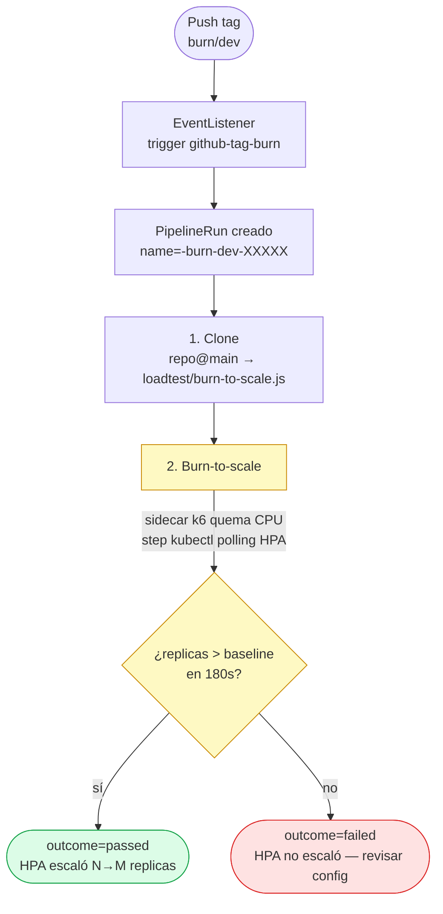

# Pipeline — cómo cada stage garantiza un despliegue correcto

Este documento responde a tres preguntas concretas:

1. **¿Qué hace cada stage del pipeline?**
2. **¿Cómo se garantiza que el load test corra sobre la versión NUEVA y no contra la vieja?**
3. **¿Qué garantiza que el circuito (orden + transiciones de estado) sea correcto para Blue/Green y Canary?**

Para detalles de implementación (imágenes, comandos exactos, RBAC) ver [pipeline-internals.md](pipeline-internals.md).

---

## Visión general

El **release pipeline** `pythonapps-pipeline` tiene **6 stages**:

```
┌─────────┐  ┌─────────────┐  ┌────────────┐  ┌──────────────┐  ┌───────────┐  ┌──────────────┐
│ 1.Clone │→ │ 2.Build/Push│→ │ 3.Bump GO  │→ │4.Wait ArgoCD │→ │5.LoadTest │→ │6.Promote/RB  │
└─────────┘  └─────────────┘  └────────────┘  └──────────────┘  └───────────┘  └──────────────┘
   git           Kaniko          yq + push       polling state    k6 funcional    kubectl patch
   clone         a DockerHub     a gitops repo   ArgoCD+Rollout   contra preview   subresource
```

Cada stage **bloquea** los siguientes hasta cumplir su contrato. Si cualquiera falla, el pipeline se corta y el Stage 6 hace `abort` (rollback automático) para las strategies que lo soportan.

| # | Task | Imagen | Sobre qué actúa | Output |
|---|------|--------|-----------------|--------|
| 1 | `git-clone-app` | `alpine/git` | repo de la app (en GitHub) | tree en `/workspace/source/src/` |
| 2 | `kaniko-build-push` | `kaniko-project/executor` | imagen Docker | imagen pusheada a Docker Hub con tag `<semver>` |
| 3 | `bump-gitops-image` | `alpine/git` + `mikefarah/yq` | gitops repo (`values.yaml` de cada env) | commit pusheado + result `commit-sha` |
| 4 | `wait-argocd-sync` | `bitnami/kubectl` | ArgoCD Application + Rollout (cluster) | Rollout listo (Paused legacy / RS-ready enterprise) + result `strategy` |
| 5 | `run-load-test` | `bitnami/kubectl` + `grafana/k6` | preview/stable svc | result `outcome`. Gated por `enabled` (legacy) o forzado (enterprise — el k6 es generador de tráfico) |
| 6 | `promote-or-rollback` | `bitnami/kubectl` | Rollout (patch subresource o solo observación) | Rollout `Healthy` o `Degraded` |

### Dos modelos: legacy y enterprise

El pipeline soporta **dos modelos de promoción**, y se adapta solo según lo que el chart generó (introspección del Rollout vivo, sin params extra):

| | **LEGACY** (`analysis.enabled: false`) | **ENTERPRISE** (`analysis.enabled: true`) |
|---|---|---|
| Dueño de la decisión | el **pipeline** (Stage 6 patchea) | **Argo Rollouts** (vía `AnalysisRun` sobre Prometheus) |
| Stage 4 espera | `phase=Paused` | RS nuevo ready (`updatedReplicas>=1`) |
| Stage 5 (k6) | **valida** — emite `outcome`, gated por flag `loadtest` | **genera tráfico** para el `AnalysisRun` — corre siempre |
| Stage 6 | `kubectl patch` promote/abort | **observa** `phase=Healthy`/`Degraded` |
| Rollback | el pipeline lo dispara si k6 falla | Argo lo hace **automático** si el análisis falla |

**El dueño de la verdad** es el Stage 6 en modo legacy, o **Argo Rollouts** en modo enterprise. Validaciones de **capacidad** (HPA scale-up) viven en un [**pipeline separado**](#pipeline-auxiliar--burn-to-scale-capacity-test) que se dispara on-demand. Ver el final de este documento.

---

## Stage 1 — Clone

**Qué hace**: clona el repo de la app **exactamente en el commit del tag pushado**. El TriggerBinding extrae `git_revision = body.ref` (e.g. `refs/tags/release/v1.2.0/dev`) y se lo pasa al Task.

**Sobre qué actúa**: `loadtest/`, `Dockerfile`, `app/` del repo de la app.

**Por qué importa para los stages siguientes**:
- Stage 2 (build) usa el Dockerfile que clonó este stage → la imagen sale del **mismo commit** que disparó el pipeline.
- Stage 5 (load-test) usa los scripts en `/workspace/source/src/loadtest/` que clonó este stage → los tests que corren son los del **mismo commit** que se está desplegando. Si la versión nueva trae cambios en el contrato (nuevos endpoints, schema de response), los scripts actualizados los validan.

> **Single source of truth**: los scripts k6 viven en el repo de la app, no en este repo. Así no se desincronizan con la app.

---

## Stage 2 — Build & Push

**Qué hace**: `kaniko build` desde el contexto clonado en Stage 1 → push a `docker.io/<user>/<app>:<tag>`.

**Sobre qué actúa**: Docker Hub.

**Garantía**: la imagen `valentinobruno/webserver-api01:v1.2.0` que se publica es **bit-exacta** del código en `refs/tags/release/v1.2.0/...`. No hay forma de que Stage 5 pruebe otra imagen distinta a la que se acaba de buildear — el tag de la imagen está atado al tag de git.

---

## Stage 3 — Bump GitOps

**Qué hace**: clona el repo de infra, ejecuta `yq e '.image.tag = "v1.2.0"'` sobre el `values.yaml` de cada env del param `environments`, commitea y pushea.

**Sobre qué actúa**: `gitops/` y `charts/pythonapps/apps/<app>/<env>/values.yaml` del repo de infra (este repo).

**Output crítico**: emite el `result commit-sha` con el full SHA del commit pusheado. **Este SHA es lo que el Stage 4 va a esperar que ArgoCD reporte como `app.status.sync.revision`** — es el ancla anti-race-condition.

---

## Stage 4 — Wait ArgoCD (el stage clave para correctness)

Este stage es **el que garantiza que el load test corra sobre la versión nueva**, no la vieja. Vale la pena detallar exactamente cómo lo hace.

### 4.1 Polling de ArgoCD: "¿el commit del Stage 3 ya fue aplicado?"

```sh
# Forzar refresh inmediato (sin esto, ArgoCD podría tardar hasta 3min en notar el commit)
kubectl annotate application $APP_CR -n argocd \
  argocd.argoproj.io/refresh=normal --overwrite

while [ $ELAPSED -lt $TIMEOUT ]; do
  REVISION=$(kubectl get application $APP_CR -n argocd \
    -o jsonpath='{.status.sync.revision}')

  if [ "$SYNC" = "Synced" ] && [ "$REVISION" = "$EXPECTED_SHA" ]; then
    # ArgoCD reportó que aplicó el commit del Stage 3
    break
  fi
  sleep 5
done
```

**Garantía 1**: hasta que `app.status.sync.revision == commit-sha del Stage 3`, no se avanza. Si ArgoCD aplicó un commit más viejo (porque el polling todavía no detectó el bump), el stage sigue esperando. **Sin esto** habría una race condition: Stage 5 podría correr cuando ArgoCD todavía tiene la versión vieja.

### 4.2 Polling del Rollout: "¿la spec ya tiene el image-tag nuevo Y el estado correcto?"

El estado esperado depende de **strategy** + **modo**:

```sh
while [ $ELAPSED -lt $TIMEOUT ]; do
  PHASE=$(kubectl get rollout $ROLLOUT -n $NS -o jsonpath='{.status.phase}')
  SPEC_TAG=$(... image | sed 's|.*:||')
  UPDATED=$(kubectl get rollout $ROLLOUT -n $NS -o jsonpath='{.status.updatedReplicas}')

  [ "$SPEC_TAG" != "$IMAGE_TAG" ] && continue   # la spec DEBE reflejar el tag nuevo

  case "${STRATEGY}/${MODE}" in
    rollingupdate/*)   [ "$PHASE" = "Healthy" ] && exit 0 ;;
    */legacy)          [ "$PHASE" = "Paused" ]  && exit 0 ;;   # espera el promote del pipeline
    */enterprise)      [ "$UPDATED" -ge 1 ]     && exit 0 ;;   # RS nuevo ready, Argo ya corre el AnalysisRun
  esac
done
```

**Garantía 2**: `rollout.spec...image` debe terminar con el `image-tag` del pipeline run — el Rollout vivo ya apunta a la imagen recién buildeada.

**Garantía 3 — modo LEGACY (BG/Canary)**: el Rollout está en `Paused`. Argo creó el RS nuevo atado al preview/canary svc, el switch NO ocurrió (`autoPromotionEnabled: false` / `pause: {}`). Stage 5 le pega al preview/canary y habla **exclusivamente con el RS nuevo**, después Stage 6 promueve.

**Garantía 3 — modo ENTERPRISE (BG/Canary)**: NO esperamos `Paused`. Con `autoPromotionEnabled: true` + análisis, el Rollout **no pausa** — apenas el RS nuevo está ready, Argo arranca el `AnalysisRun`. El Stage 4 sale en cuanto `updatedReplicas>=1` y deja que el Stage 5 genere tráfico **en paralelo** con el análisis de Argo. Si esperáramos `Paused`, el Stage 4 colgaría (ese estado nunca llega) y el análisis correría sin tráfico → `Degraded`.

**Garantía 4 (RollingUpdate)**: tiene que estar `Healthy`. Como rollingupdate no tiene preview, el load test va contra el stable directo — pero recién después de que todos los pods fueron actualizados.

### 4.3 Auto-detección de strategy

El task lee la spec del Rollout vivo y deriva la strategy:

```sh
if kubectl get rollout $ROLLOUT -n $NS \
    -o jsonpath='{.spec.strategy.blueGreen.activeService}' | grep -q .; then
  STRATEGY="bluegreen"
elif kubectl get rollout $ROLLOUT -n $NS \
    -o jsonpath='{.spec.strategy.canary.steps}' | grep -q .; then
  STRATEGY="canary"
else
  STRATEGY="rollingupdate"
fi
```

Esto emite el result `strategy` que consume Stage 5 (para elegir script y URL) y Stage 6 (para elegir patch). **La strategy no se pasa por el tag git** — se infiere del estado del Rollout, lo que evita que un developer empuje un tag con la strategy equivocada.

---

## Stage 5 — Load Test (¿contra qué endpoint actúa?)

### Doble rol del Stage 5 según el modo

El Task tiene un step previo `detect-mode` (con `kubectl`) que introspecciona el Rollout y escribe `legacy` o `enterprise` a un archivo del workspace. El step `run-k6` lo lee y decide:

**Modo LEGACY** — el k6 **valida**. Gating por el flag `loadtest` del tag:

```sh
if [ "$ENABLED" != "true" ]; then
  echo "STAGE 5 — run-load-test (SKIPPED)"   # loadtest=false o ausente
  printf "passed" > "$(results.outcome.path)"
  exit 0
fi
# loadtest=true → corre k6, outcome refleja el resultado real (thresholds k6)
```

**Modo ENTERPRISE** — el k6 **genera tráfico** para el `AnalysisRun` de Argo Rollouts:

```sh
if [ "$MODE" = "enterprise" ] && [ "$ENABLED" != "true" ]; then
  ENABLED="true"   # el k6 NO es opcional: sin tráfico el AnalysisRun da NaN → Degraded
fi
```

En modo enterprise el k6 corre **siempre**, ignorando el flag del tag. La decisión promote/abort la toma Argo Rollouts vía Prometheus — el `outcome` que emite este task es irrelevante (el Stage 6 enterprise ni lo mira).

**Por qué el default del flag `loadtest` es `false` (modo legacy)**: el load-test fuerza CPU → HPA scale durante el switchover, lo que enmascara la dinámica natural del Rollout. Para validar capacidad existe el [**pipeline burn**](#pipeline-auxiliar--burn-to-scale-capacity-test) que es independiente del release.

### Si k6 corre (loadtest=true), contra qué endpoint apunta

```sh
BASE_URL="http://${RELEASE}-stable.${NS}.svc.cluster.local:8080"
PREVIEW_URL="http://${RELEASE}-preview.${NS}.svc.cluster.local:8080"

case "$STRATEGY" in
  bluegreen)
    SCRIPT="load-bluegreen.js"
    EXTRA="-e PREVIEW_URL=$PREVIEW_URL"   # ← apunta al preview (green RS)
    ;;
  canary)
    SCRIPT="load-canary.js"
    EXTRA="-e BASE_URL=$BASE_URL"         # ← apunta al stable (recibe split de tráfico)
    ;;
  *)
    SCRIPT="smoke.js"
    EXTRA="-e BASE_URL=$BASE_URL"
    ;;
esac

k6 run $EXTRA "/workspace/source/src/loadtest/$SCRIPT"
```

### Endpoint exacto por estrategia

| Strategy | URL del load test | Por qué |
|----------|-------------------|---------|
| **bluegreen** | `http://<app>-<env>-preview.<ns>.svc.cluster.local:8080` | El svc preview enrutea **100% al green RS** (versión nueva). Pegarle al stable testería la versión vieja. |
| **canary** | `http://<app>-<env>-stable.<ns>.svc.cluster.local:8080` | El traffic split del argo-rollouts envía 5/25/50% al canary RS. Pegarle al stable **simula tráfico real** durante el canary. |
| **rollingupdate** | `http://<app>-<env>-stable.<ns>.svc.cluster.local:8080` | No hay preview separado — el RS nuevo reemplazó al viejo en el stable svc. |

### Cadena de garantías que aseguran que el k6 corre contra la versión nueva

```
Stage 1: clone @ <tag>
   │  Trae loadtest/*.js del commit que se va a desplegar.
   ▼
Stage 2: build @ <tag>
   │  Imagen valentinobruno/webserver-api01:<tag> contiene el código de ese commit.
   ▼
Stage 3: bump values.yaml → image.tag = <tag>
   │  Commit en gitops repo. Emite commit-sha.
   ▼
Stage 4: poll ArgoCD hasta que sync.revision == commit-sha
   │  Garantía 1: ArgoCD aplicó EL commit del Stage 3 (no uno más viejo).
   ▼
Stage 4: poll Rollout hasta que spec.image tag == <tag> Y phase == Paused
   │  Garantía 2: el Rollout vivo apunta a la imagen recién buildeada.
   │  Garantía 3: el preview/canary RS está listo y el switch NO ocurrió.
   ▼
Stage 5: k6 run --env URL=preview-svc
        │
        ▼   Stage 4 garantizó que el preview-svc enrutea al RS con image=<tag>
        El k6 está hablando con la versión NUEVA.
```

### Fail-fast si el script no existe

```sh
if [ ! -f "$SCRIPT_PATH" ]; then
  echo "ERROR: $SCRIPT no existe en el repo de la app"
  printf "failed" > "$(results.outcome.path)"
  exit 1
fi
```

Si el repo de la app cambió de strategy (e.g. de bluegreen a canary) pero olvidó agregar el script (`loadtest/load-canary.js`), el pipeline **rompe ruidosamente** en lugar de marcar verde silencioso. No hay deploy posible sin tests.

---

## Stage 6 — Promote o Rollback

El task arranca detectando el **modo** por introspección del Rollout (¿tiene `prePromotionAnalysis` / `steps[*].analysis`?):

### Modo ENTERPRISE — solo observa

Argo Rollouts ya ejecutó (o está ejecutando) los `AnalysisRun` y decidió promote/abort. El Stage 6 **no patchea nada** — espera hasta una fase terminal con timeout extendido (600s, un canary multi-step puede tardar):

```sh
wait_terminal() {
  while [ $ELAPSED -lt 600 ]; do
    PHASE=$(kubectl get rollout $R -n $NS -o jsonpath='{.status.phase}')
    case "$PHASE" in
      Healthy)   return 0 ;;   # análisis pasó → release OK
      Degraded)  return 1 ;;   # análisis falló → Argo ya hizo rollback automático
    esac
    sleep 10
  done
}
```

Si queda `Degraded`, el Stage 6 imprime los `AnalysisRun` asociados (`kubectl get analysisrun`) para debug rápido y marca el pipeline `Failed`. El rollback ya lo hizo Argo — el pipeline solo lo reporta.

### Modo LEGACY — patchea según `outcome` × `strategy`

| Strategy | Outcome | Acción | Patch |
|----------|---------|--------|-------|
| **bluegreen** | passed | promote → switch tráfico al green | `kubectl patch rollout $R --subresource=status -p '{"status":{"pauseConditions":null}}'` |
| **bluegreen** | failed | abort → mantener stable (blue), destruir green | `kubectl patch rollout $R -p '{"spec":{"abort":true}}'` |
| **canary** | passed | promote completo → 100% canary, skip steps restantes | `kubectl patch rollout $R --subresource=status -p '{"status":{"promoteFull":true}}'` |
| **canary** | failed | abort → vuelve todo al stable | `kubectl patch rollout $R -p '{"spec":{"abort":true}}'` |
| **rollingupdate** | passed | no-op (rollout completa solo) | — |
| **rollingupdate** | failed | abort | `kubectl patch rollout $R -p '{"spec":{"abort":true}}'` |

Después de patchear, el Task espera con timeout 180s la fase esperada (`Healthy` si promote, `Degraded` si abort). Si no se alcanza, el stage falla → el PipelineRun queda `Failed`.

### Production gate

Si `PRIMARY_ENV == production`, el stage **no patchea nada**. En su lugar agrega una annotation a la ArgoCD application:

```yaml
metadata:
  annotations:
    belo/pending-promote: "true"
    belo/promote-reason: "load-test-passed"
```

Y exit OK. Un humano debe promover manualmente. Ver detalle en [pipeline-internals.md → promote-or-rollback](pipeline-internals.md#6-promote-or-rollback).

---

## Garantías del circuito completo

| Garantía | Cómo se logra |
|----------|---------------|
| **El load test corre sobre la versión nueva** | Stage 4 espera que `rollout.spec.image-tag == <tag-del-pipeline>` Y `phase == Paused` antes de avanzar. El preview svc enrutea solo al RS con esa imagen. |
| **No se promueve nada sin tests** | Stage 5 falla con `exit 1` si el script no existe. Stage 6 lee `outcome` y aborta si fue `failed`. |
| **No se prueba una versión vieja por race condition** | Stage 4 espera `app.status.sync.revision == commit-sha del Stage 3`. El force-refresh saca el polling de 3min default a ~5s. |
| **Rollback automático si los tests fallan** | Stage 6 emite `kubectl patch spec.abort=true` para BG/Canary/Rolling. Argo Rollouts destruye el RS nuevo, mantiene stable. |
| **Production no se auto-promueve** | Stage 6 detecta `PRIMARY_ENV=production` y solo annota — promote manual obligatorio. |
| **Capacidad se valida fuera del release** | El [burn pipeline aparte](#pipeline-auxiliar--burn-to-scale-capacity-test) se dispara on-demand cuando el equipo quiere validar HPA. No contamina el release pipeline ni los timings. |
| **Re-pushear el mismo tag falla limpio** | TriggerTemplate usa `name: <app>-pipelinerun-<tag>` determinístico. Re-push → `AlreadyExists` en lugar de re-ejecutar silencioso. |
| **PipelineRun queda trazable por release** | Naming determinístico permite `kubectl get pipelinerun webserver-api01-pipelinerun-v1.2.0 -o yaml` y ver todo el detalle del deploy. |

---

## Mapa de results entre tasks

```
Stage 3 bump-gitops.results.commit-sha    ──→  Stage 4 wait-argocd.params.expected-commit-sha
params.image-tag                          ──→  Stage 4 wait-argocd.params.image-tag

Stage 4 wait-argocd.results.strategy      ──→  Stage 5 load-test.params.strategy
                                          ──→  Stage 6 promote-rollback.params.strategy

Stage 5 load-test.results.outcome         ──→  Stage 6 promote-rollback.params.outcome
```

---

## ¿Y si quiero saltarme stages?

El pipeline `pythonapps-pipeline` está cableado en orden estricto vía `runAfter:` — no hay forma de saltarse stages estructurales (clone/build/bump/wait/promote). Pero **Stage 5 (load-test) es opt-in vía el flag `loadtest=true` del tag**:

```bash
# Release rápido — Stage 5 corre pero skipea k6 internamente (~2s)
git tag release/v1.2.0/dev
git push origin release/v1.2.0/dev

# Release con load-test — Stage 5 ejecuta k6 completo (~60-90s)
git tag release/v1.2.0/dev/loadtest=true
git push origin release/v1.2.0/dev/loadtest=true
```

El default `loadtest=false` cubre el caso "hotfix sin tests de carga" sin necesidad de operar fuera del pipeline. El auto-promote downstream se ejecuta normal — el outcome del Stage 5 es `passed` por construcción cuando el k6 fue skipeado.

Si necesitás bypassear el pipeline entero (e.g. el cluster está caído y solo querés tocar gitops + promover manual), corré los comandos equivalentes:

```bash
# 1. Bumpear values.yaml a mano y pushear
# 2. ArgoCD detecta y aplica
# 3. Promover manualmente:
kubectl argo rollouts promote webserver-api01-dev -n webserver-api01-dev
```

Eso queda **fuera** del pipeline y deja un rastro claro de que no fue un deploy normal.

---

## Diagrama de flujo end-to-end (release pipeline)

```mermaid
flowchart TB
    START([Push tag<br/>refs/tags/release/v1.2.0/dev<br/>opc: /loadtest=true])
    EL[EventListener<br/>CEL filter<br/>extrae run_load_test]
    TR[PipelineRun creado<br/>param run-load-test]

    START --> EL --> TR

    TR --> S1[1. Clone<br/>repo@tag]
    S1 --> S2[2. Build+Push<br/>Kaniko → Docker Hub]
    S2 --> S3[3. Bump GitOps<br/>commit-sha emitido]
    S3 --> S4{4. Wait ArgoCD}

    S4 -->|sync@commit-sha<br/>rollout.spec@image-tag<br/>phase=Paused| S5{5. Load Test<br/>enabled=run-load-test}
    S4 -->|timeout| FAIL1[Pipeline FAILED]

    S5 -->|enabled=true<br/>k6 vs preview/canary| S5K[k6 ramp + thresholds]
    S5 -->|enabled=false default<br/>skipea k6| S5S[outcome=passed]

    S5K -->|outcome=passed| S6_OK{6. Promote}
    S5K -->|outcome=failed| S6_KO{6. Rollback}
    S5S --> S6_OK

    S6_OK -->|BG: patch pauseConditions=null| HEALTHY1[Rollout Healthy]
    S6_OK -->|Canary: patch promoteFull=true| HEALTHY1
    S6_OK -->|Rolling: no-op| HEALTHY1

    S6_KO -->|abort=true| DEGRADED[Rollout Degraded<br/>stable intacto]

    HEALTHY1 --> END_OK([Pipeline OK<br/>versión nueva sirviendo 100%])
    DEGRADED --> END_KO([Pipeline OK<br/>rollback efectivo])

    classDef ok fill:#dcfce7,stroke:#16a34a
    classDef fail fill:#fee2e2,stroke:#dc2626
    classDef gate fill:#fef9c3,stroke:#ca8a04

    class HEALTHY1,END_OK,END_KO ok
    class FAIL1 fail
    class S4,S6_OK,S6_KO gate
```

---

## Pipeline auxiliar — burn-to-scale (capacity test)

`pythonapps-burn-pipeline` es un Pipeline Tekton **separado** del release pipeline. Su propósito es validar que el HPA escala correctamente bajo carga sostenida. Se dispara on-demand (no en cada release).

### Por qué un pipeline aparte y no un Stage 7

1. **Enterprise pattern**: en producción real, los capacity/chaos tests no se ejecutan en cada release — son lentos (~3min de CPU saturada), la config del HPA cambia raramente, y mezclarlos con el flujo de release crea falsos negativos. Viven en un pipeline aparte que el SRE/Platform team gatilla cuando hace falta (semanal, antes de un evento de alto tráfico, después de tunear el HPA, etc.).

2. **Problema técnico con BG**: si corriéramos burn antes de Stage 6 (promote), durante `phase=Paused` el HPA promedia CPU entre los pods del RS stable (blue, idle) y del RS preview (green, bajo carga). La dilución resultante (~50% promedio aunque el preview esté a 100%) **impide el scale-up** y el test daría falsos negativos. Esperar a después del promote para validar también funciona, pero entonces si el HPA falla el equipo se entera tarde (versión nueva ya productiva) y hay que hacer rollback manual.

3. **Solución limpia**: extraer el burn a un pipeline propio que apunte siempre al stable svc del Rollout ya estable. Sin race conditions, sin dilución, sin riesgo a la release.

4. **Promote como dueño de la verdad**: el Stage 6 del release pipeline es la última palabra sobre si una versión avanza o no. Las validaciones de capacidad son independientes — un release puede ser funcional y el HPA puede no estar bien configurado, esos son dos problemas distintos con dos respuestas distintas.

### Trigger del burn pipeline

#### A) Vía webhook GitHub (tag `burn/<env>`)

Desde el repo de la app:

```bash
git tag burn/dev
git push origin burn/dev
```

El segundo trigger del EventListener (`github-tag-burn`) filtra `refs/tags/burn/*`, extrae el env vía CEL overlay (`body.ref.split('/')[3]`) y crea un PipelineRun usando `pythonapps-burn-trigger-template`.

> **Re-correr**: a diferencia de los release tags (que deben ser unique semver), los `burn/<env>` se re-corren seguido. El TriggerTemplate usa `generateName: <app>-burn-<env>-` (no `name:` fijo), por lo que cada push agrega un sufijo random. Si volvés a empujar el mismo tag tenés que borrarlo primero:
>
> ```bash
> git tag -d burn/dev
> git push --delete origin burn/dev
> git tag burn/dev && git push origin burn/dev
> ```

#### B) Manual sin webhook

```bash
make burn-test APP=webserver-api01 ENV=dev
```

Usa `envsubst` sobre `manifests/tekton/pipelinerun-burn-manual.yaml` y crea un PipelineRun directo. Mismo template que el del webhook.

### Stages (solo 2)

```
┌─────────┐  ┌──────────────────────────────┐
│ 1.Clone │→ │ 2.Burn-to-scale              │
│ (alpine │  │ sidecar k6 + step kubectl    │
│  /git)  │  │ monitorea replicas del HPA   │
└─────────┘  └──────────────────────────────┘
```

| # | Task | Imagen | Qué hace |
|---|------|--------|----------|
| 1 | `git-clone-app` | `alpine/git` | Clona el repo de la app para tener `loadtest/burn-to-scale.js` |
| 2 | `run-burn-to-scale` | sidecar `grafana/k6` + step `bitnami/kubectl` | Sidecar genera 200 VUs sostenidos sin sleep contra `<app>-<env>-stable.<ns>.svc:8080`. Step principal lee `rollout.status.replicas` cada 10s durante 180s. Marca `outcome=passed` si `MAX_REPLICAS > BASELINE` en algún momento de la ventana |

### Diseño con sidecar

```yaml
sidecars:
- name: loadgen           # corre k6 burn-to-scale.js EN PARALELO al step principal
  image: grafana/k6:latest
  script: |
    sleep 10              # darle tiempo al step para capturar baseline
    k6 run -e TARGET_URL=$STABLE_URL /workspace/source/src/loadtest/burn-to-scale.js
    sleep 600             # mantener vivo hasta que el step termine

steps:
- name: monitor-hpa       # corre kubectl polling
  image: bitnami/kubectl:latest
  script: |
    BASELINE=$(kubectl get rollout $R -o jsonpath='{.status.replicas}')
    MAX_SEEN=$BASELINE
    ELAPSED=0
    while [ $ELAPSED -lt 180 ]; do
      R=$(kubectl get rollout $R -o jsonpath='{.status.replicas}')
      [ "$R" -gt "$MAX_SEEN" ] && MAX_SEEN=$R
      sleep 10
      ELAPSED=$((ELAPSED+10))
    done
    if [ "$MAX_SEEN" -gt "$BASELINE" ]; then echo passed; else echo failed; fi
```

Las dos partes comparten el workspace `source` (donde quedó `loadtest/burn-to-scale.js` después del Stage 1). El sidecar se inicia al mismo tiempo que el step y vive hasta que el step termina.

### Condición de éxito

`MAX_REPLICAS > BASELINE_REPLICAS` durante la ventana de monitoreo (180s default). Si el HPA escaló de 1 → 2 (o más) replicas **al menos una vez**, pasa. No exige que se mantenga escalado al final — la HPA tiene stabilization windows largas para scale-down (~5min default) y el burn dura solo 2-3min.

### Results emitidos

| Result | Tipo | Significado |
|--------|------|-------------|
| `outcome` | string | `passed`, `failed`, o `skipped` (en production) |
| `baseline-replicas` | number | Replicas observadas al inicio del burn |
| `max-replicas` | number | Máximo de replicas observado durante el burn |

Visibles en el Tekton Dashboard, en `tkn pipelinerun describe`, o por `kubectl get pipelinerun -l pipeline=burn -o yaml | yq .status.results`.

### Production gate

El step principal hace:

```sh
if [ "$PRIMARY_ENV" = "production" ]; then
  echo "PRODUCTION: burn-to-scale skipped."
  printf "skipped" > "$(results.outcome.path)"
  exit 0
fi
```

Por defecto **no se quema CPU productiva**. Si el equipo quiere validar HPA en prod (e.g., en una ventana de mantenimiento), debe modificar este check explícitamente y entender el impacto.

### Diagrama del burn pipeline


